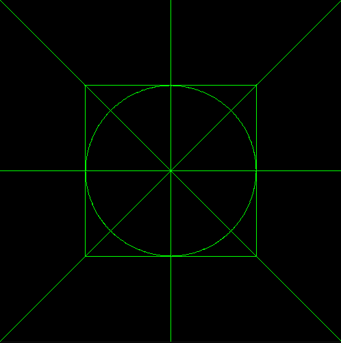
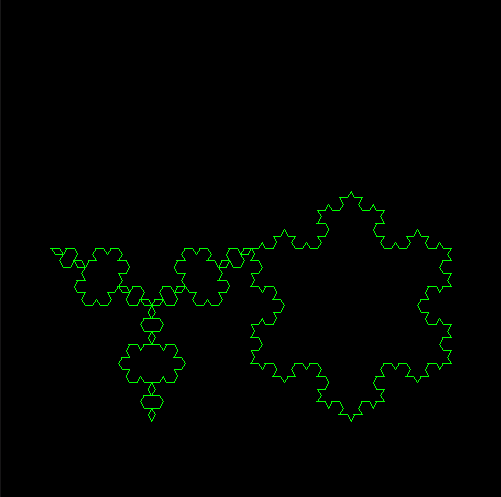
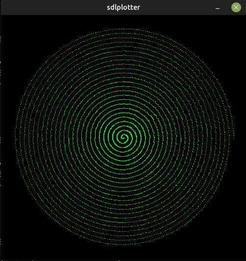
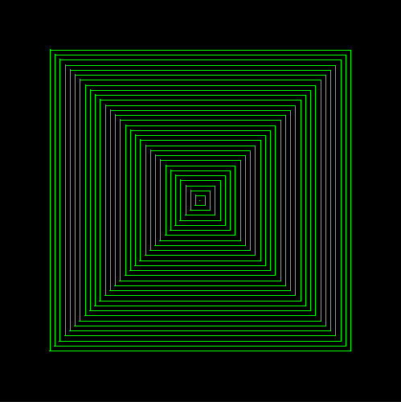
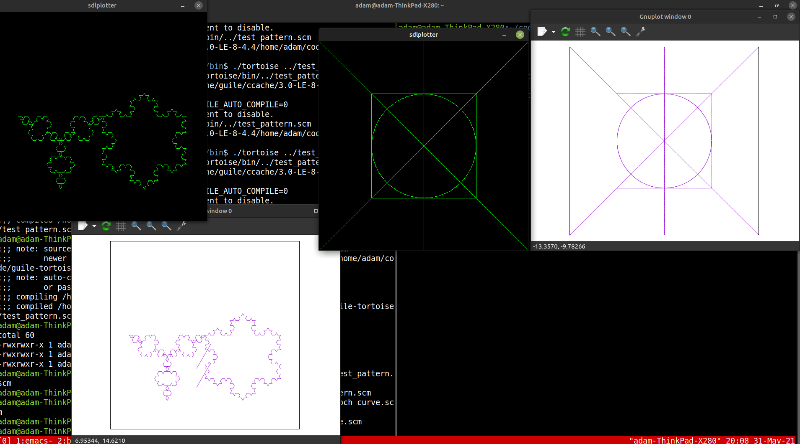
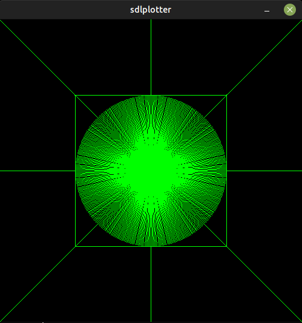
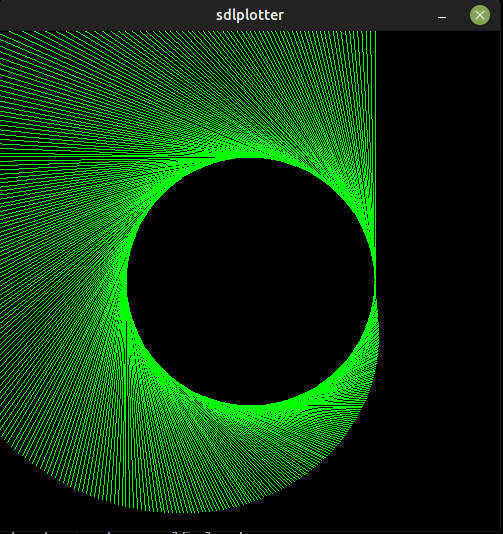

# Guile Tortoise

I started out following the code in the [guile tutorial](https://www.gnu.org/software/guile/docs/guile-tut/tutorial.html). I hit a but where the koch curve wasn't looking right so I wanted to make my own plotter in SDL. It was a bit of the distraction since the issue wasn't with gnuplot at all but with the order of the line segment args. I also added a few scheme files of my own. The sdlplotter I implemented takes a set of 4 doubles and plots the line to the screen. I added all the tortoise commands from the tutorial but also added `tortoise-center` that resets the position of the tortoise without clearing.

# Running
- If you build tortoise it will look for the sdlplotter binary in the bin folder so build that first
- Once it is running you get a scheme REPL where you can input (tortoise-*) commands.
- Alternativly libguile supports running a scheme file as an argument, i.e. `./tortoise ../test_pattern.scm`
- Quitting the repl will not close the sdlplotter or gnuplot but they should exit if you just close the windows.

## Ubuntu Packages used to develop and build this
- `build-essential`
- `guile-3.0`
- `guile-3.0-dev`
- `gnuplot`
- `sdl2-dev`

## Showcase
- 
- 
- 
- 
- 

## Happy Accidents
- 
- 
